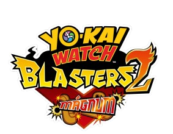
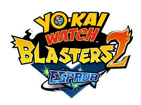

    
    

    
<table align="center">
  <tr>
    <td>
    
    </td>
    <td>
    
    </td>
  </tr>
</table>

# Yo-Kai Watch Blasters 2 Espada y Magnum traduccion al español
Juego siendo traducido de manera manual desde la versión japonesa original y la versión traducida al inglés e italiano.

# Importante
Este proyecto aún está en proceso, si encuentras algún error o algo que se deba arreglar abre un [**issue**](https://github.com/ENOCH-VK/YWB2_ES/issues).

# Instalación de la traducción (TEXTO)
Descarga la última versión desde [***releases***](https://github.com/ENOCH-VK/YWB2_ES/releases)

### Citra:
En el directorio de datos de Citra:
  `\home\{USERNAME}\.config\Citra\` en **Linux**.
  `C:\users\{USERNAME}\AppData\Roaming\Citra` en **Windows**.

Lo más probable es que la carpeta donde se necesiten poner los datos sea en `{...AppData\Roaming\Citra\load\mods\00040000001C9C00 y 00040000001C9400\`

### Nintendo 3DS

Para luma: `luma\titles\00040000001C9C00 y 00040000001C9400`

# Importante
Activar parcheador de juegos de Luma3ds para que funcione la traducción.

# Instalación de la traducción (VÍDEO)

> [Tutorial de Citra](https://discord.com/channels/846980324034347008/1162320333764825118/1162323994549170227)

> [Tutorial de Nintendo 3DS](https://www.youtube.com/watch?v=FtelkhlB1Rg&feature=youtu.be)

# Project Make a Dream
Make a Dream es un servidor de Discord en el que están varias de las traducciones de los juegos de Yo-kai Watch al español, mangas, y fan-games hechos por la comunidad.
Cualquier duda en el servidor, siempre contestamos.

> [Discord](https://discord.gg/project-make-a-dream-846980324034347008)
